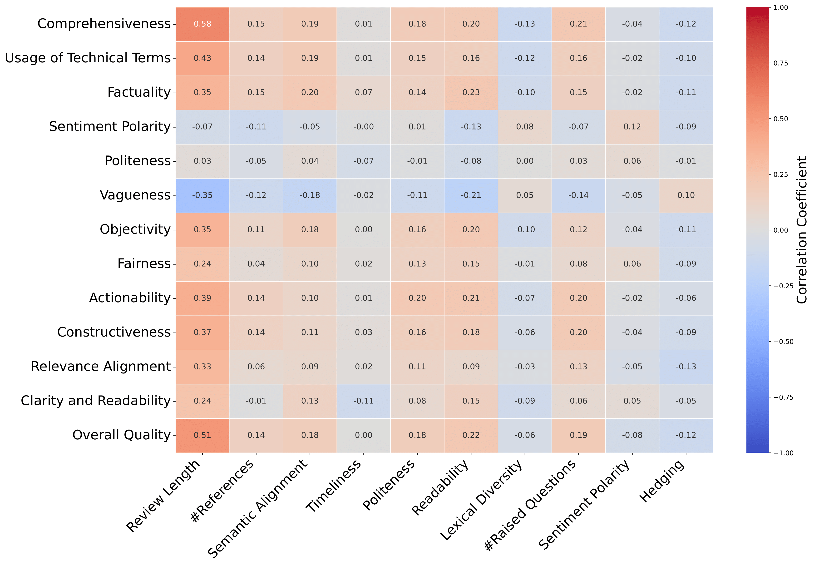
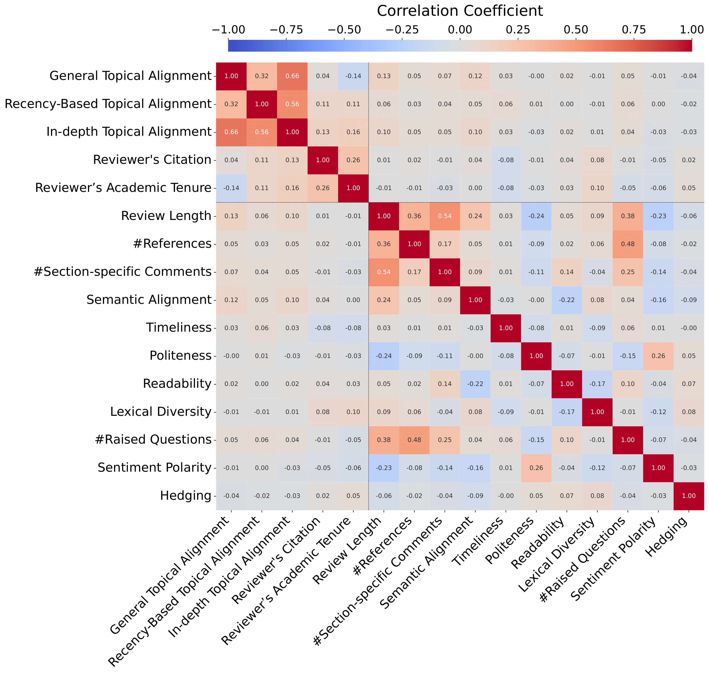
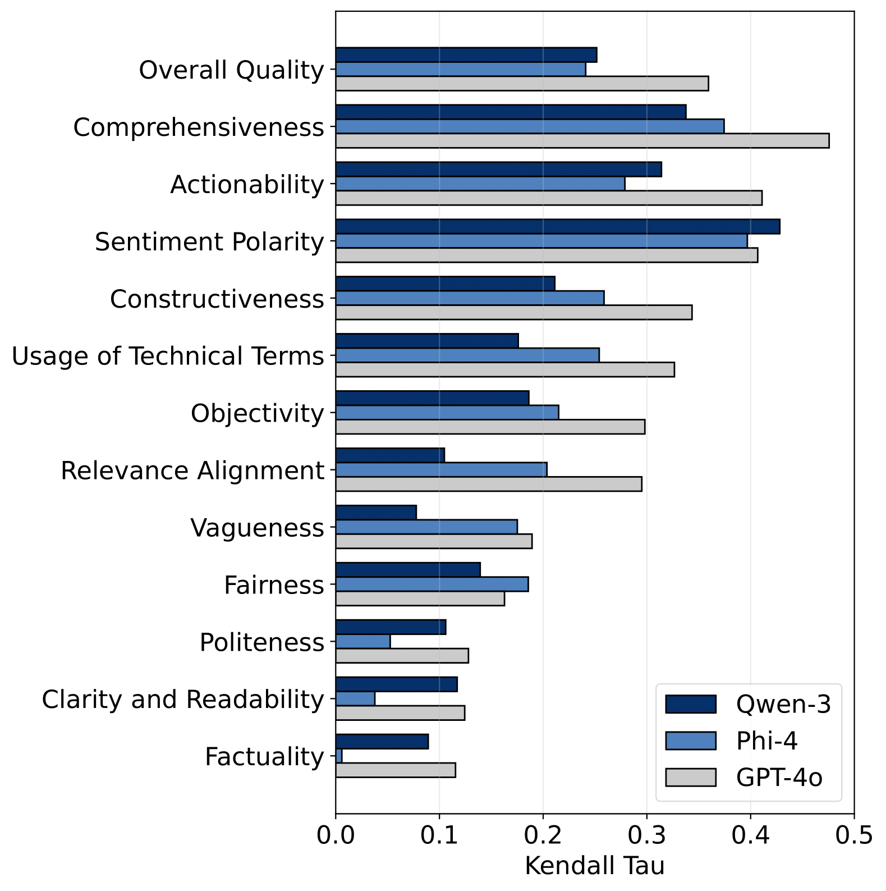
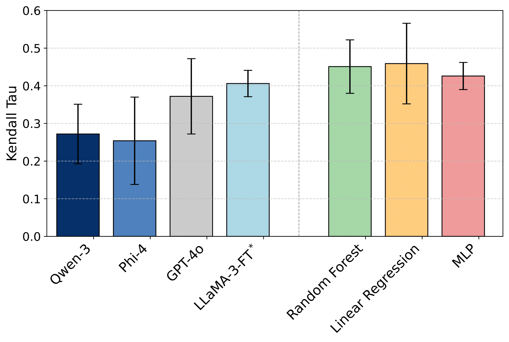

# RottenReviews: Benchmarking Review Quality with Human and LLM-Based Judgments

This repository contains the code and data for the paper "**RottenReviews** : Benchmarking Review Quality with Human and LLM-Based Judgments". It should be noted that due to the size of the dataset, we are unable to provide the full dataset in this repository. Hence, the repository contains the codes for the sake of reproducibility and the data are available on Google Drive.

By following the instructions below, you can download the dataset and run files to either reproduce the results or use the dataset for your research.

# Dataset

### Download the Dataset
Note: You need to install the gdown package to download the dataset.
```bash
pip install gdown
```

If you already have the gdown package installed, you can use the following commands to download the dataset:
```bash
cd RottenReviews/
gdown --folder https://drive.google.com/drive/folders/1Uqfyl5uBKBdZem9kQHkhNSPMPnwqJrYV?usp=sharing
```
### Project Tree
```
RottenReviews
├─ data
│  ├─ human-annotation-data/ (all the human annotated data would appear here)
│  ├─ processed/ (all the processed and cleaned data would appear here)
│  └─ raw/ (all the raw data crawled from different venues would appear here)
├─ feature_analysis
│  ├─ Figure/ (all the figures and visualizations would appear here)
│  ├─ stats-qmetrics-distributions-f1000-swj.ipynb
│  └─ stats-qmetrics-distributions-iclr-neurips-HA.ipynb
├─ feature_extraction
│  └─ process-neurips2023.ipynb
├─ human_annotation
│  ├─ HA-decision-vs-overall-quality.ipynb
│  ├─ interface/ (web application for gathering human annotation data)
│  ├─ llm-process-human-annotation-data.ipynb
│  ├─ llm-self-correlation-map.ipynb
│  └─ llm-vs-human-kendaltau.ipynb
├─ images/ (all the figures presented in README.md)
├─ predict_review_quality_score
│  ├─ Folds/ (train and test splitted data with 5 folds)
│  ├─ all_folds_data.csv
│  ├─ classical-ml-vs-llms.ipynb
│  ├─ human_llms_qmetrics.csv
│  ├─ human_vs_llm.csv
│  └─ llama3-finetune/
├─ requirements.txt
├─ README.md
└─ .gitignore
```

# Statistics
### Statistics of Quantifiable Metrics
These metrics are defined and obtained using quantifiable methods. To compute these numbers on your own, you can run the "Process Raw Data" section of the notebooks provided for each venue in the [feature_extraction](feature_extraction/) folder. Also, to get the results for LLMs, you can run the LLM section of the same notebooks.

| Metric                         | Dependency | NeurIPs | ICLR   | F1000  | SWJ     |
|-------------------------------|------------|--------:|-------:|-------:|--------:|
| Review Length                 | Review     | 439.4   | 424.5  | 398.17 | 782.09  |
| # References                  | Review     | 1.25    | 1.42   | 0.29   | 2.29    |
| # Section-specific Comments   | Review     | 1.43    | 1.73   | 1.78   | 7.27    |
| Semantic Alignment            | Review     | 0.90    | 0.90   | 0.88   | 0.90    |
| Timeliness                    | Review     | 59.13   | 39.81  | 142.36 | 89.46   |
| Politeness                    | Review     | 0.84    | 0.81   | 0.83   | 0.75    |
| Readability                   | Review     | 38.02   | 37.65  | 36.60  | 43.86   |
| Lexical Diversity             | Review     | 0.77    | 0.77   | 0.76   | 0.76    |
| # Raised Questions            | Review     | 3.76    | 4.02   | 1.72   | 2.88    |
| Sentiment Polarity            | Review     | 0.11    | 0.11   | 0.15   | 0.10    |
| Hedging                       | Review     | 0.005   | 0.009  | 0.013  | 0.007   |
| General Topic Alignment   | Reviewer   | N/A     | N/A    | 0.74   | 0.76    |
| Recency-Based Topic Align | Reviewer   | N/A     | N/A    | 0.65   | 0.64    |
| In-depth Topical Alignment| Reviewer   | N/A     | N/A    | 0.87   | 0.88    |
| Reviewer’s Citation       | Reviewer   | N/A     | N/A    | 4683.0 | 2476.08 |
| Reviewer’s Academic Tenure| Reviewer   | N/A     | N/A    | 29.16  | 25.68   |

# Visualizations
<div align="center">
  
  
</div>
<p align="center">
  <em>Left: Kendall’s τ correlation between human-evaluated quality dimensions Y-axis and quantifiable metrics X-axis. Right: Correlation between quantifiable metrics on F1000.</em>
</p>

---

<div align="center">
  
  
</div>
<p align="center">
  <em>Left: Kendall’s τ correlation between human-evaluated and LLMs-evaluated quality dimensions. Right: Kendall’s τ correlation between human-evaluated and models-predicted Overall Quality of peer reviews.</em>
</p>

### Dataset Files Overview
| Folder Name   | File Name               | File Size | Record Type | Number of Records | Format  |
|---------------|-------------------------|-----------|-------------|-------------------|---------|
| raw           | f1000research          | 497 MB    | Submission  | 4,509  | JSON    |
| raw           | semantic-web-journal   | 12.7 MB   | Submission  | 796    | JSON    |
| raw           | iclr-2024              | 148 MB    | Submission  | 7,262  | PKL     |
| raw           | neurips-2023           | 81.6 MB   | Submission  | 3,395  | PKL     |
| processed     | f1000research          | 41.2 MB   | Review      | 9,482      | CSV     |
| processed     | semantic-web-journal   | 14.6 MB   | Review      | 2,337      | CSV     |
| processed     | iclr-2024              | 147 MB    | Review      | 28,028     | JSON    |
| processed     | neurips-2023           | 80.6 MB   | Review      | 15,175     | JSON    |
| processed     | merged-200-papers      | 3.3 MB    | Submission  | 200    | JSON    |
| processed     | HA_ALL_qmetrics        | 3.3 MB    | Review      | 661        | JSON    |
| processed     | HA_ALL_qwen            | 3.5 MB    | Review      | 661        | JSON    |
| processed     | HA_ALL_llama           | 3.3 MB    | Review      | 661        | JSON    |
| processed     | HA_ALL_phi4            | 46 KB     | Review      | 661        | CSV     |
| processed     | HA_ALL_gpt             | 45 KB     | Review      | 661        | CSV     |
| processed     | f1000_reviewers_info   | 2.87 GB   | Reviewer    | 8831       | PKL     |
| processed     | sw_reviewers_info      | 93.4 MB   | Reviewer    | 701        | PKL     |
| processed     | f1000_reviewers_similarity_info   | 1.2 MB   | Reviewer    | 8831       | PKL     |
| processed     | sw_reviewers_similarity_info      | 72 KB    | Reviewer    | 701       | PKL     |


# Abstract
The quality of peer review plays a critical role in scientific publishing, yet remains poorly understood and challenging to evaluate at scale. In this work, we introduce *RottenReviews*, a benchmark designed to facilitate systematic assessment of review quality. *RottenReviews* comprises over 15,000 submissions from four distinct academic venues enriched with over 9,000 reviewer scholarly profiles and paper metadata. We define and compute a diverse set of quantifiable review-dependent and reviewer-dependent metrics, and compare them against structured assessments from large language models (LLMs) and expert human annotations. Our human-annotated subset includes over 700 paper–review pairs labeled across 13 explainable and conceptual dimensions of review quality. Our empirical findings reveal that LLMs, both zero-shot and fine-tuned, exhibit limited alignment with human expert evaluations of peer review quality. Surprisingly, simple interpretable models trained on quantifiable features outperform fine-tuned LLMs in predicting overall review quality.

# Citation
